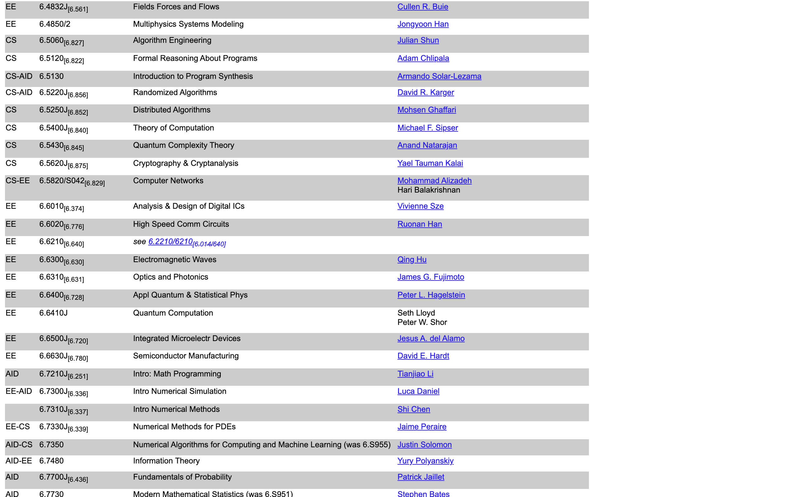
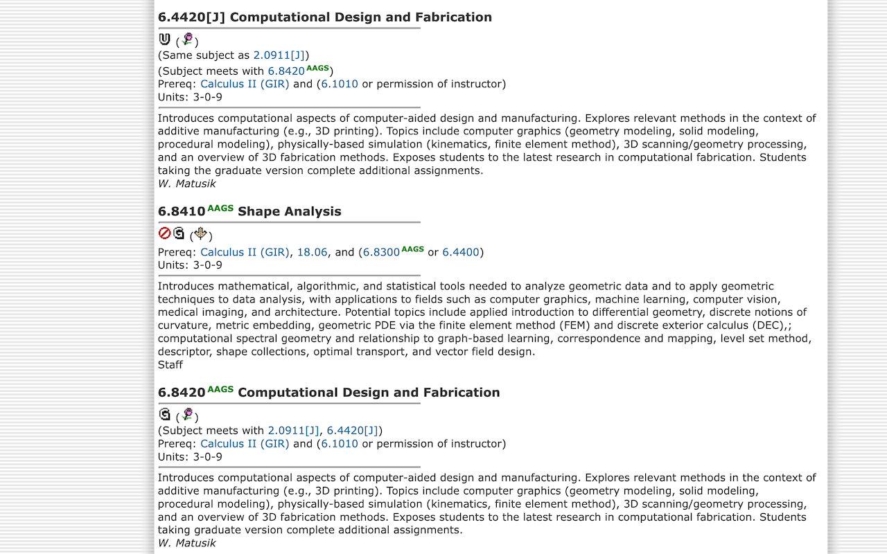
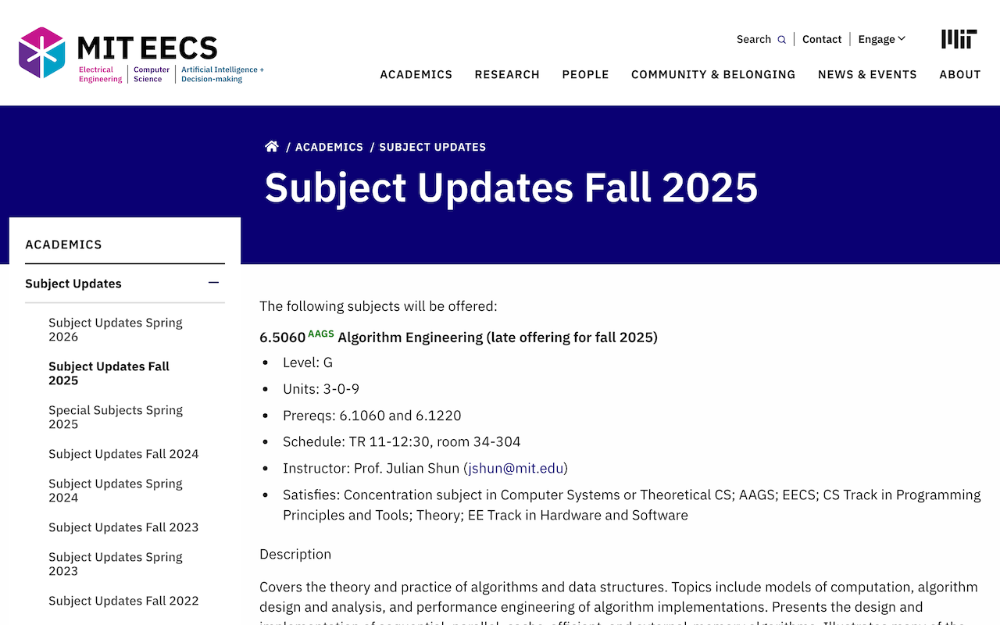

# MIT EECS AAGS Checker

A Chrome extension that automatically highlights AAGS (Approved Advanced Graduate Subjects) on MIT EECS "who is teaching what" pages.

[](https://chromewebstore.google.com/detail/mit-eecs-aags-checker/nfoffleelcgbabibmmbjmicefmanmeeo)


[](https://github.com/junruren/MIT-EECS-AAGS/actions/workflows/release.yml)

## 🎯 What It Does

This extension helps MIT EECS students identify AAGS (Approved Advanced Graduate Subjects) across multiple MIT websites:

### 1. Who Is Teaching What Table
When you visit any MIT EECS "who is teaching what" page (for any semester), the extension automatically:
- Fetches the latest AAGS requirements list
- Adds an "AAGS" column at the beginning of the subject table
- Shows ✓ for subjects on the AAGS list
- Lists matching subjects for multi-subject entries (e.g., "6.1000/A/B")

### 2. MIT Course Catalog Pages (NEW in v2.0.0)
When you browse MIT course catalogs and planning pages, the extension automatically:
- Detects subject numbers in page text (e.g., "6.1200", "18.650", "9.66")
- Adds a green <sup>AAGS</sup> superscript link next to AAGS subjects
- Links directly to MIT's AAGS requirements page
- Works on:
  - Course catalog pages (catalog.mit.edu/subjects/*)
  - Student catalog pages (student.mit.edu/catalog/*)
  - EECS subject updates (www.eecs.mit.edu/academics/subject-updates*)

## 📦 Installation

### Option 1: Install from Chrome Web Store
1. Visit the [MIT EECS AAGS Checker Chrome Web Store page](https://chromewebstore.google.com/detail/mit-eecs-aags-checker/nfoffleelcgbabibmmbjmicefmanmeeo)
2. Click "Add to Chrome"
3. Confirm by clicking "Add extension"

### Option 2: Install from Source (Developer Mode)

1. **Download the Extension**
   ```bash
   git clone https://github.com/junruren/MIT-EECS-AAGS.git
   cd MIT-EECS-AAGS-Classes/chrome-extension
   ```

2. **Install in Chrome**
   - Open Chrome and navigate to `chrome://extensions/`
   - Enable "Developer mode" (toggle in top right)
   - Click "Load unpacked"
   - Select the `chrome-extension` folder

3. **Use It**
   - Visit any [MIT EECS who_is_teaching_what page](https://eecseduportal.mit.edu/eduportal/who_is_teaching_what/)
   - Or browse MIT course catalog pages (catalog.mit.edu, student.mit.edu, eecs.mit.edu)
   - The extension will automatically highlight AAGS subjects!

## 🖼️ Screenshots

### Table Enhancement Feature

*Before: Standard who_is_teaching_what table*


*After: Table with AAGS column showing checkmarks*

### Text Annotation Feature (v2.0.0)
When browsing MIT course catalog pages, AAGS subjects are automatically annotated with green superscript links:
- Example: "Students should complete 6.1200<sup style="color: #28a745">AAGS</sup> before taking this subject"
- Clicking the <sup>AAGS</sup> link takes you directly to MIT's AAGS requirements page



## ✨ Features

### Table Enhancement (who_is_teaching_what)
- **Automatic Detection**: Works on any semester's who_is_teaching_what page
- **Real-time AAGS Data**: Fetches the current AAGS list from MIT's degree requirements page
- **Smart Subject Parsing**: Handles complex formats like "6.1000/A/B[6.0001+2]"
- **Visual Indicators**:
  - ✓ Green checkmark for single AAGS subjects
  - Subject list (e.g., "6.100A, 6.100B") for partial matches in multi-subject entries
  - Empty cell for non-AAGS subjects

### Text Annotation (catalog pages) - NEW in v2.0.0
- **Automatic AAGS Detection**: Scans page text for subject numbers
- **Superscript Links**: Adds green <sup>AAGS</sup> markers next to AAGS subjects
- **Dynamic Content Support**: Watches for page updates (works with single-page applications)
- **Smart Pattern Matching**: Detects various formats (6.1200, 18.650, 9.UAR, etc.)
- **Unobtrusive**: Maintains original page layout and functionality

### General
- **New Numbering System**: Consistently uses MIT's new 4-digit subject numbering
- **No Remote Code**: All code is bundled with the extension (no external script loading)
- **Lightweight**: Minimal permissions required

## 🔧 Subject Number Formats Supported

| Format | Example | Parsed As |
|--------|---------|-----------|
| Simple | `6.0001` | `["6.0001"]` |
| With suffix | `6.100A` | `["6.100A"]` |
| Special subjects | `6.S890` | `["6.S890"]` |
| Combo (new[old]) | `6.1220J[6.046]` | `["6.1220J"]` |
| Multiple | `6.1000/A/B` | `["6.1000", "6.100A", "6.100B"]` |
| Complex | `6.1000/A/B[6.0001+2]` | `["6.1000", "6.100A", "6.100B"]` |
| Research/Thesis | `6.UAR`, `6.UAT` | `["6.UAR"]`, `["6.UAT"]` |

## 🛠️ Development

This repository contains both the Chrome extension and development tools:

### Chrome Extension (`/chrome-extension`)
- Production-ready extension code
- See [chrome-extension/README.md](chrome-extension/README.md)

### Python Development Tools (`/python-tools`)
- Scripts for scraping and analyzing EECS data
- Subject number parsing utilities
- Jupyter notebook for testing
- See [python-tools/README.md](python-tools/README.md)

## 📋 Requirements

### For Users
- Chrome browser (or Chromium-based browser)
- Access to MIT EECS websites

### For Developers
- Chrome browser for testing
- Python 3.8+ (optional, for development tools)

## 🤝 Contributing

Contributions are welcome! Please feel free to submit a Pull Request.

1. Fork the repository
2. Create your feature branch (`git checkout -b feature/AmazingFeature`)
3. Commit your changes (`git commit -m 'Add some AmazingFeature'`)
4. Push to the branch (`git push origin feature/AmazingFeature`)
5. Open a Pull Request

For detailed guidelines, see [CONTRIBUTING.md](CONTRIBUTING.md).

## 🚀 Development & Release

### Building the Extension

```bash
npm run build
```

This creates a production-ready zip file in the `chrome-extension/` directory.

### Creating a Release

Releases are automated via GitHub Actions. To create a new release:

1. Update version in `chrome-extension/manifest.json` (single source of truth)
2. Update `CHANGELOG.md` with changes
3. Run `npm run build` (automatically syncs version to package.json)
4. Commit and push to main
5. Create and push a version tag:
   ```bash
   git tag v1.0.1
   git push origin v1.0.1
   ```

The GitHub Action will automatically build and create a release with the extension zip file attached.

**Note**: `package.json` version is automatically synced from `manifest.json`.

For detailed instructions, see [RELEASE.md](RELEASE.md).

## 📝 License

This project is licensed under the MIT License - see the [LICENSE](LICENSE) file for details.

## 🎓 For MIT EECS Students

This tool is designed to help MIT EECS students quickly identify which subjects satisfy AAGS requirements when planning their course schedules.

**Note**: Always verify subject requirements with official MIT EECS academic resources.

## 🐛 Known Issues

- Extension requires page reload if AAGS data changes during browsing session
- Icons are placeholder images (contributions welcome!)

## 📧 Contact

For questions or issues, please [open an issue](https://github.com/junruren/MIT-EECS-AAGS/issues) on GitHub.

---

Made with ❤️ for MIT EECS students